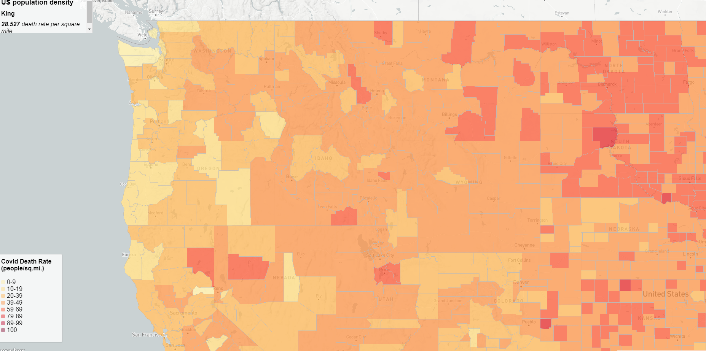
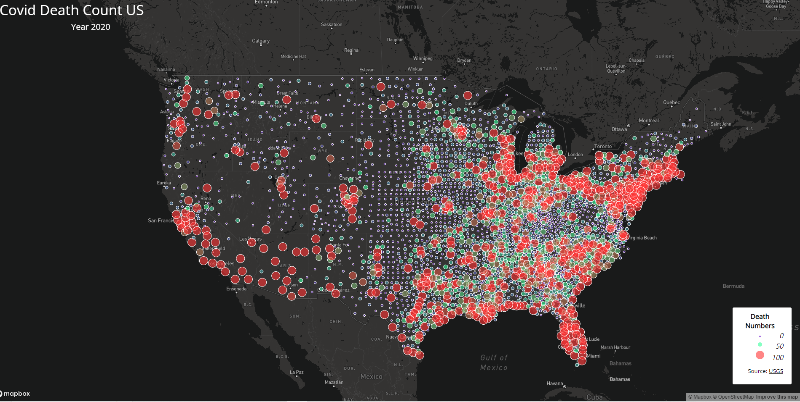

# Geog458 CovidDeathRate VS Counts 03 -- two maps showing covid death rate and death counts over US in year 2020
## Introduction
This project created a proportional symbol map and a choropleth map based on the US death data of COVID-19 in the year 2020. I named the repository Geog458CovidDeadthRate VS Counts 03 so that the visitors know this project is talking about something related to COVID-19 death data. However, because COVID is now a very popular topic and people have seen reports and projects about it so much, I added the details about counts vs rates so that visitors will know more about the maps and maybe stay to take a closer look.   

### Map1 Choropleth Map -- Covid19 Death Rates in US 2020
Map 1 is the choropleth map with each county's death rate marked with different colors. If you hover your mouse over one county, the box on the upper left corner will tell you the county name and death rate for 2020. The legend locates at the lower-left corner of the map, linking the colored counties with their corresponding death rates. 

### Map2 Proportional Symbol Map -- Covid19 Death Counts in US 2020
Map 2 is a proportional symbol map, representing the death counts of each county with a single dot with a white stroke outside. I choose to stick with the white stroke because whatever stroke I use, it blend with the color of the symbols and makes it harder to follow the legend provided. The proportional symbol map is chosen for county death counts because if a county is small but has more people die, a choropleth map will not be able to show the higher amount of deaths. If the user clicks on a dot from the map, a small window will pop up, telling the amount of people who died because of COVID-19 in 2020. 

According to Professor Zhao, the COVID-19 death data is collected from the [New York Times](https://www.nytimes.com/). The population data used for the death rate calculation is from the [2018 ACS estimate](https://www.census.gov/programs-surveys/acs/technical-documentation/table-and-geography-changes/2018/1-year.html). Lastly, the map shapefiles are from the [US Census Bureau](https://www.census.gov/). I required data from [Professor Zhao's repository](https://github.com/jakobzhao/geog458/tree/master).   
I also referred to a lot of code from the upper repository provided by Professor Zhao and Map 1's code was also referred from [geog328](https://github.com/jakobzhao/geog328/tree/main).    

Here are two screenshots taken on my computer when launching the two maps:
  
  
  
